# edu-assets

小学生向けWeb教材で共通利用する画像アセット集です。

## Badge catalog

GitHub Pagesを有効にすると、[Common Badgesの一覧サイト](./)で45種類のバッジをカテゴリー別に確認できます。検索、画像プレビュー、画像URLのコピーにも対応しています。

## Common Badges

`assets/badges/common/` contains reusable achievement badges that are independent of subject area. Each badge is a transparent 512×512 PNG. Use the stable path below from GitHub Pages:

`https://tt-sensei.github.io/edu-assets/assets/badges/common/<slug>/badge.png`

| File | 日本語名 | 意味・獲得条件の例 | Preview |
|---|---|---|---|
| `first-step/badge.png` | はじめの一歩 | 初めて学習に取り組んだ | 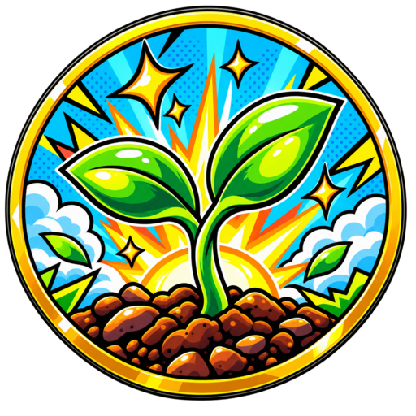 |
| `challenger/badge.png` | チャレンジャー | 新しい課題に挑戦した | 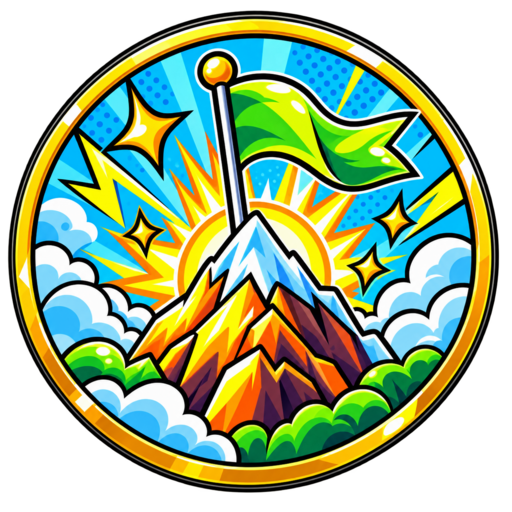 |
| `courage/badge.png` | 勇気の一歩 | 苦手な問題にも挑戦した | 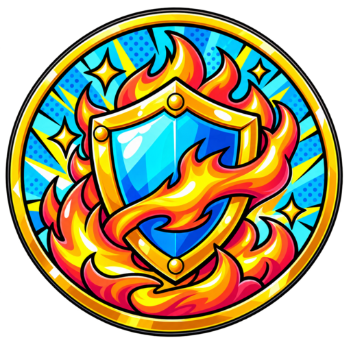 |
| `explorer/badge.png` | エクスプローラー | 新しい分野を試した | 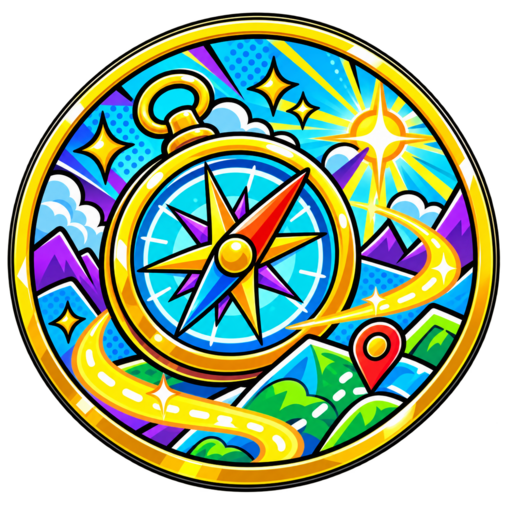 |
| `adventurer/badge.png` | 学びの冒険者 | 学習の冒険を始めた | 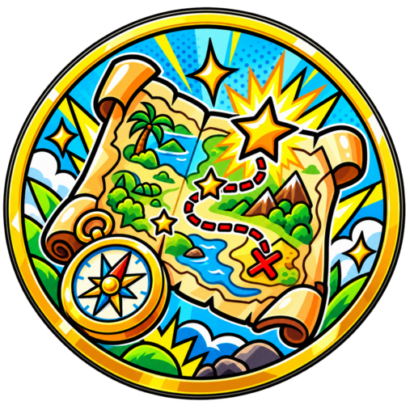 |
| `great-answer/badge.png` | ナイスアンサー | 問題に正解した | 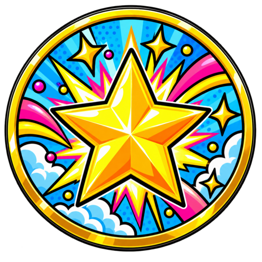 |
| `perfect/badge.png` | パーフェクト | 1セットを全問正解した | 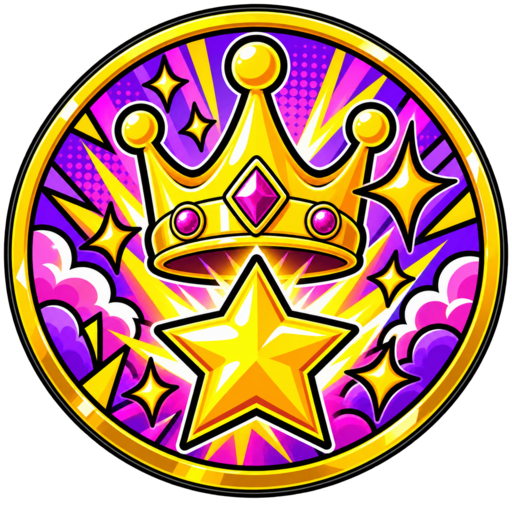 |
| `clear/badge.png` | クリア | ステージを最後まで終えた |  |
| `mission-complete/badge.png` | ミッション達成 | 指定された課題を達成した | 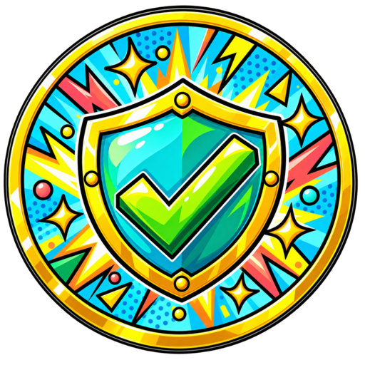 |
| `champion/badge.png` | チャンピオン | すばらしい成績を残した |  |
| `keep-going/badge.png` | 継続パワー | 継続して学習した | 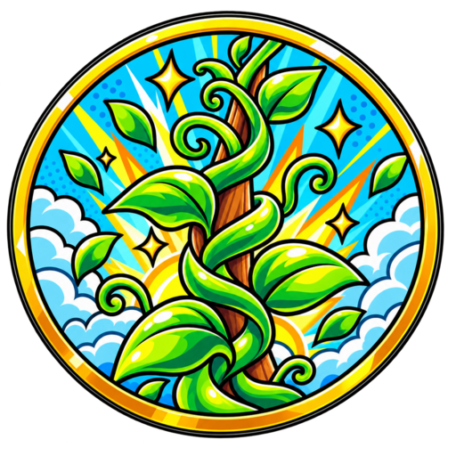 |
| `hard-worker/badge.png` | 努力家 | 何度も練習して力を伸ばした |  |
| `never-give-up/badge.png` | あきらめない心 | 間違い直しに取り組んだ | 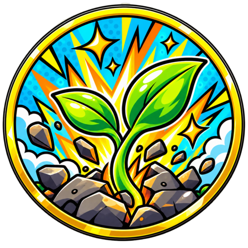 |
| `comeback/badge.png` | カムバック | 失敗後に立て直した | 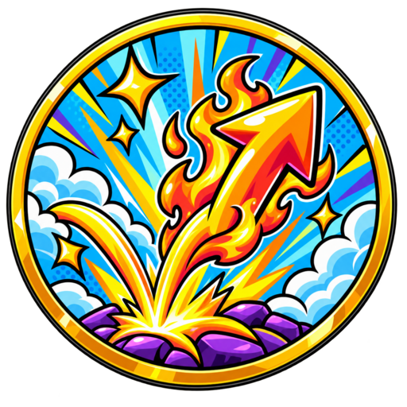 |
| `steady-progress/badge.png` | 一歩ずつ | 少しずつ記録を伸ばした | 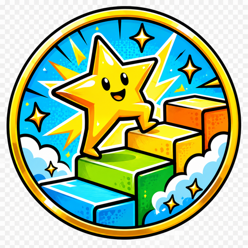 |
| `level-up/badge.png` | レベルアップ | スキルレベルが上がった |  |
| `growth/badge.png` | 成長の芽 | 前よりできることが増えた | 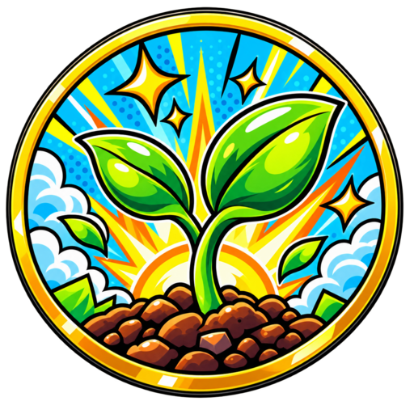 |
| `power-up/badge.png` | パワーアップ | 新しい力を身につけた | 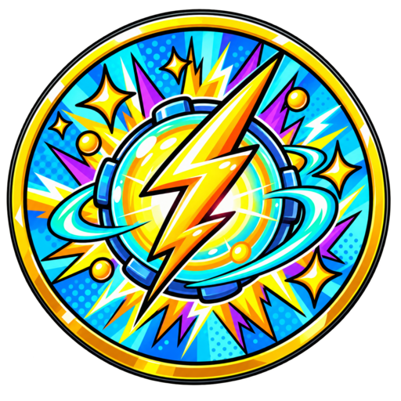 |
| `new-skill/badge.png` | 新スキル | 新しい技能を習得した |  |
| `mastery/badge.png` | マスター | 技能を安定して使えた | 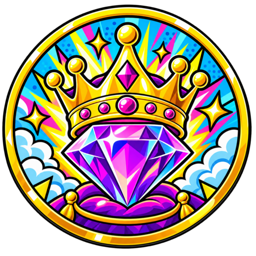 |
| `focus/badge.png` | 集中モード | 集中して課題に取り組んだ | 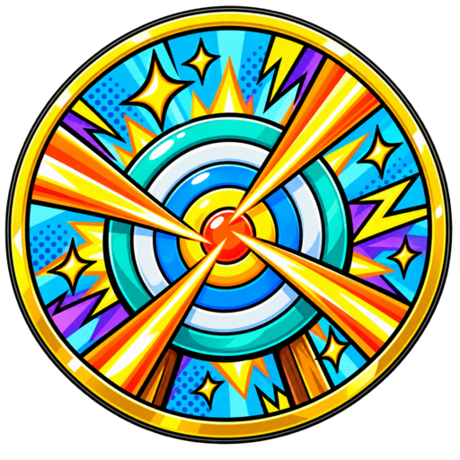 |
| `speed/badge.png` | スピードスター | すばやく正確に解けた | 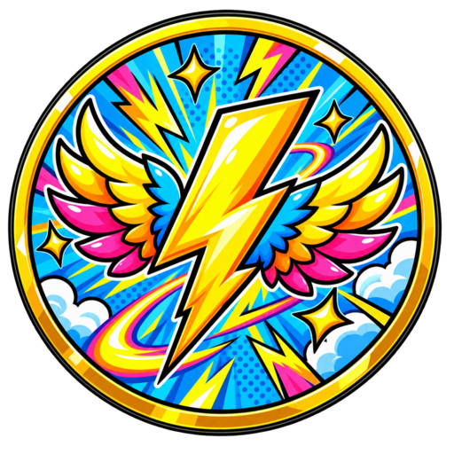 |
| `combo/badge.png` | コンボ | 連続正解を達成した |  |
| `streak/badge.png` | ストリーク | 連続日数・連続達成を更新した | 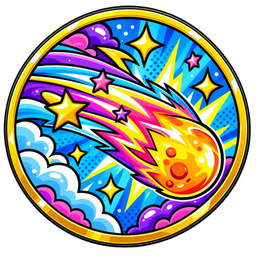 |
| `accuracy/badge.png` | 正確無比 | 正確に問題を解いた |  |
| `discovery/badge.png` | 発見 | 新しいことに気づいた | 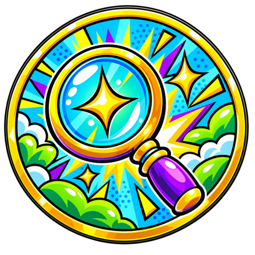 |
| `idea/badge.png` | ひらめき | よい考えや方法を見つけた | 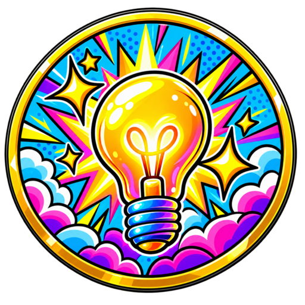 |
| `knowledge/badge.png` | 知識の本 | 必要な知識を身につけた | 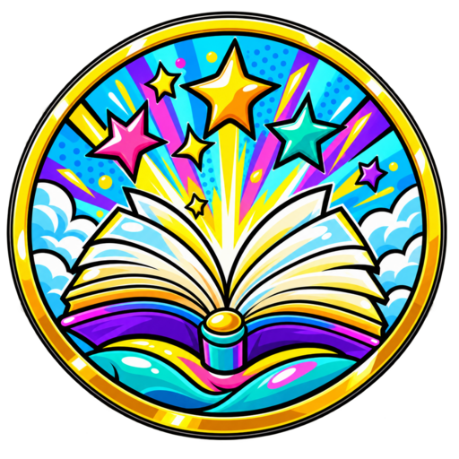 |
| `treasure/badge.png` | トレジャー | 特別な成果を見つけた | 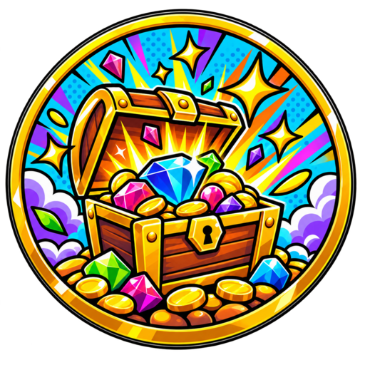 |
| `special/badge.png` | スペシャル | レアな特別実績を達成した | 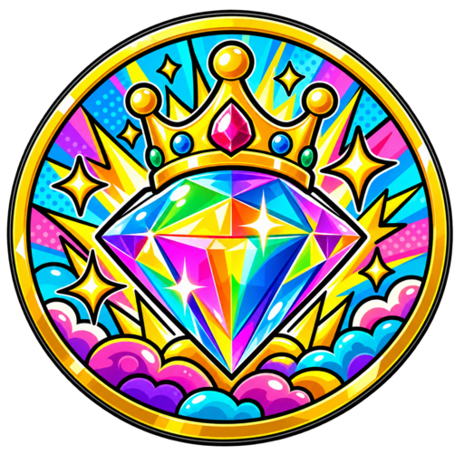 |
| `try-again/badge.png` | もういちど！ | 間違えたあと、あきらめずに再挑戦した |  |
| `breakthrough/badge.png` | にがて突破 | 苦手だった問題や課題を克服した | 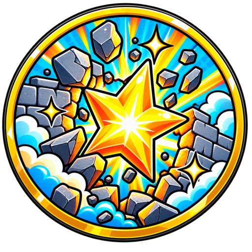 |
| `review-master/badge.png` | ふくしゅう名人 | 以前学習した内容を復習した |  |
| `practice-master/badge.png` | れんしゅう名人 | 同じ技能や問題に繰り返し取り組んだ | 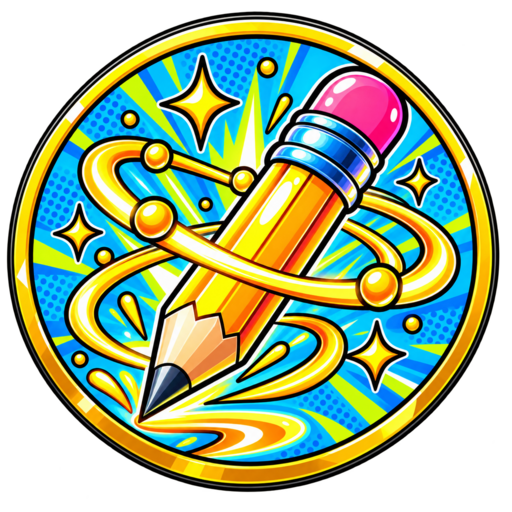 |
| `deep-thinker/badge.png` | じっくり思考 | すぐに答えを出さず、じっくり考えた | 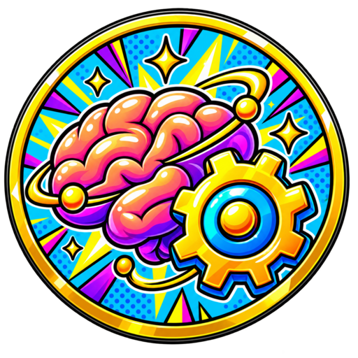 |
| `problem-solver/badge.png` | かいけつ名人 | 自分で解決方法を見つけた | 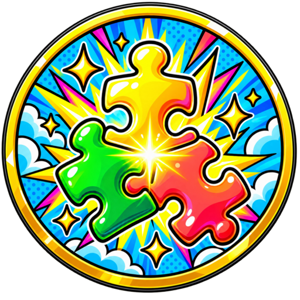 |
| `observer/badge.png` | かんさつ名人 | 細かなところまでよく見て、違いや特徴を見つけた | 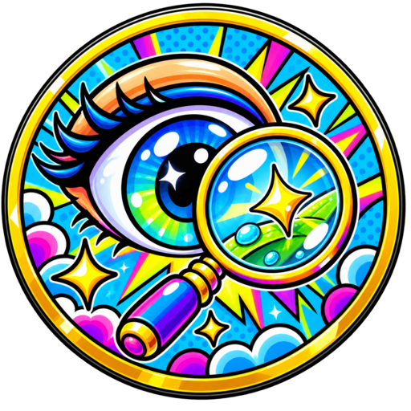 |
| `connection/badge.png` | つながった！ | 別々に学んだこと同士の関係やつながりに気づいた | 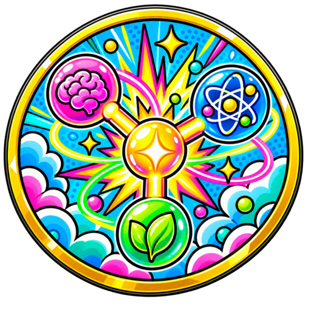 |
| `creative/badge.png` | ひらめき名人 | 自分なりの方法や工夫を考えた | 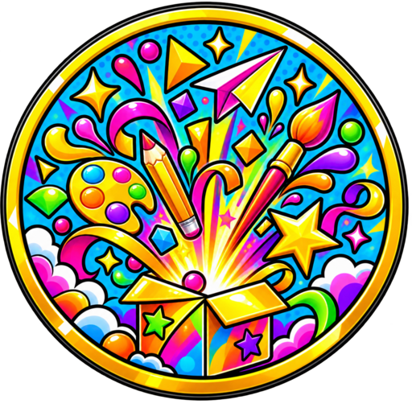 |
| `independent/badge.png` | じぶんでできた | ヒントなどに頼らず、自分の力でやり遂げた | 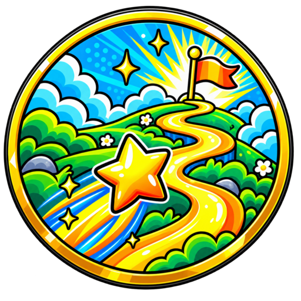 |
| `explainer/badge.png` | せつめい名人 | 答えだけでなく、理由や自分の考えを説明できた | 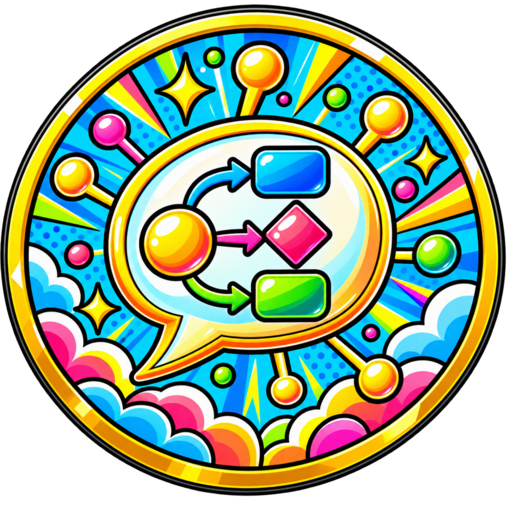 |
| `teamwork/badge.png` | きょうりょく名人 | 仲間と協力して取り組んだ |  |
| `helper/badge.png` | おたすけ名人 | 困っている仲間を助けたり、学習を支えたりした |  |
| `curiosity/badge.png` | なぜ？を大切に | 「どうしてだろう」「もっと知りたい」という疑問をもって学習した | 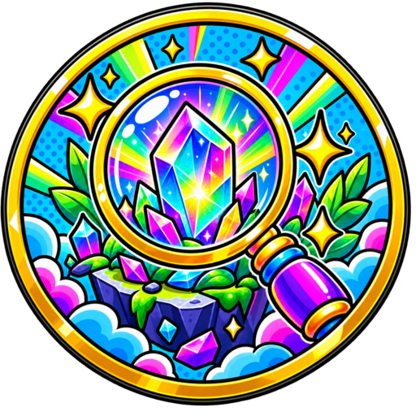 |
| `hidden-badge/badge.png` | ひみつのバッジ | 特殊条件を満たして隠し実績を達成した | 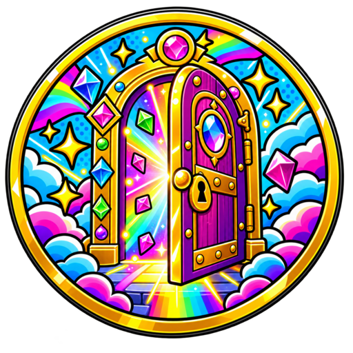 |

## Usage

```html

```

各アプリ側では、獲得条件と表示名だけをアプリの学習設計に合わせて設定してください。画像ファイルは教科に依存しないため、理科・算数・国語・社会などで同じバッジを利用できます。

## Japanese / 国語

`assets/badges/japanese/` contains reusable badges for Japanese-language learning across reading, writing, vocabulary, comprehension, oral reading, expression, imagination, and communication. Each badge is a transparent 512×512 PNG.

| File | 日本語名 | 主な意味・獲得条件の例 | Preview |
|---|---|---|---|
| `manuscript/badge.png` | ますめマスター | 自分の考えを文章としてしっかり書いた |  |
| `bookmark/badge.png` | 読みすすめた！ | 文章や本を最後まで、または一定量しっかり読み進めた | 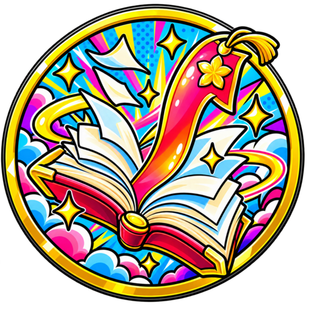 |
| `careful-writing/badge.png` | ていねい文字 | 文字を丁寧に書いた | 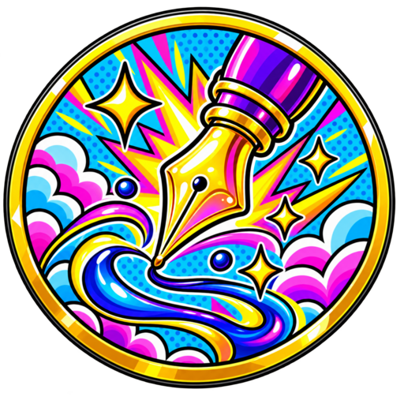 |
| `self-correction/badge.png` | 見直し名人 | 自分で読み返し、間違いや改善点を直した | 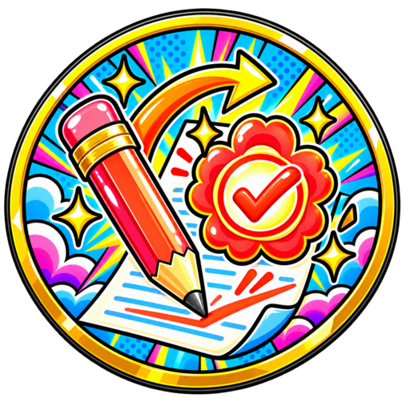 |
| `expression/badge.png` | 表現名人 | 自分らしい言葉や表現を使えた | 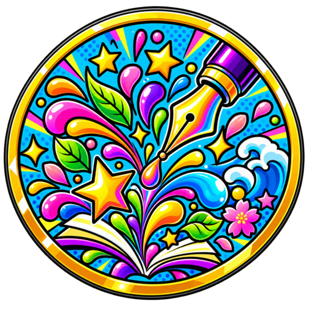 |
| `word-sprout/badge.png` | ことのはの芽 | 新しい言葉を知り、語彙が一つ増えた | 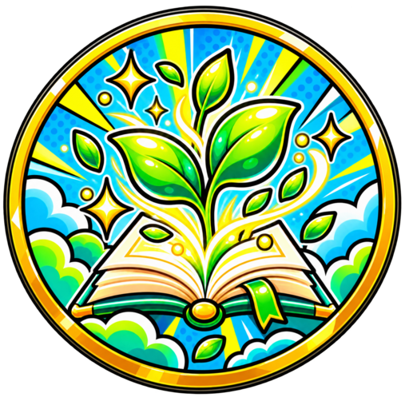 |
| `word-tree/badge.png` | ことのはの樹 | たくさんの言葉を身につけ、使える言葉が増えた |  |
| `word-weaver/badge.png` | ことばの紡ぎ手 | 言葉や文をつなぎ、まとまりのある文章を作った | 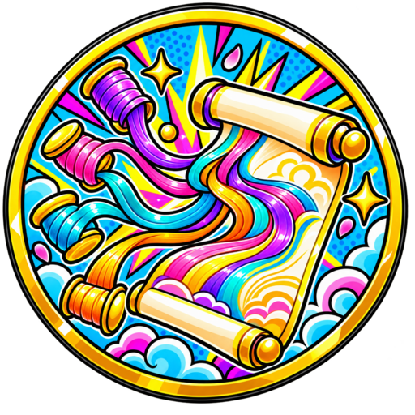 |
| `between-the-lines/badge.png` | 行間を読む | 文章に直接書かれていない気持ちや状況まで想像して読んだ | 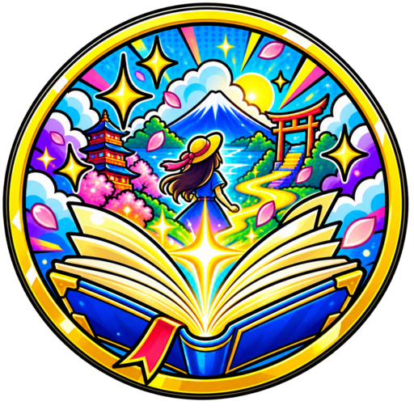 |
| `word-detective/badge.png` | ことば探偵 | 文章の細かな表現や重要な手がかりに気づいた | 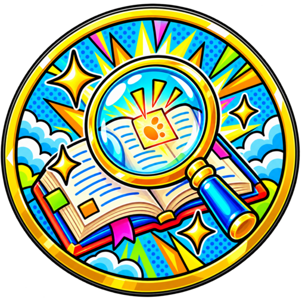 |
| `reading-aloud/badge.png` | 音読マスター | 声に出して文章をしっかり読んだ |  |
| `language-rhythm/badge.png` | ことばの響き | 言葉の響きやリズムを味わった | 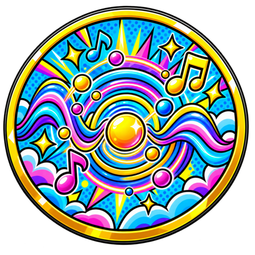 |
| `book-lover/badge.png` | 本となかよし | 本や文章を楽しんで読んだ |  |
| `language-explorer/badge.png` | 日本語たんけん | 言葉の意味や文の仕組みを自分から調べた | 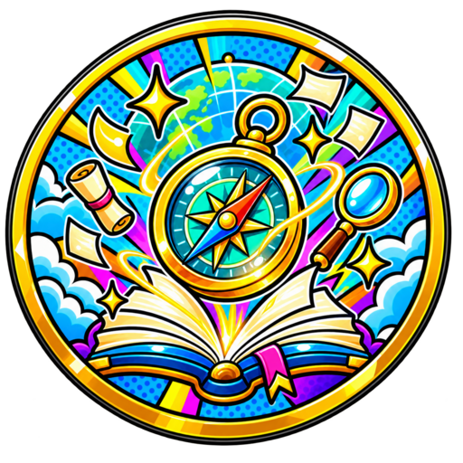 |
| `words-connect/badge.png` | ことばの架け橋 | 考えや気持ちを言葉を使って相手に伝えた | 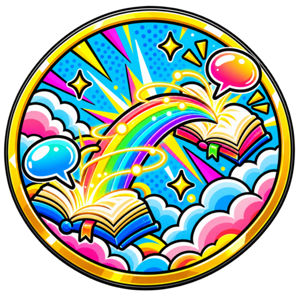 |

## Design and extension guide

生成ルール、配色、ファイル命名規則、100種類以上へ拡張するときの追加手順は [`docs/BADGE_PROMPTS.md`](docs/BADGE_PROMPTS.md) にまとめています。

追加時は、既存slugを変更せず、`assets/badges/common/<new-slug>/badge.png` を追加してください。文字・数字を画像に入れず、獲得条件や日本語名は利用アプリ側または一覧データ側で管理します。


## Math / 算数

`assets/badges/math/` contains 15 reusable badges for mathematics learning across number sense, calculation, relationships, patterns, geometry, measurement, visualization, reasoning, and solution strategies. Each badge is a transparent 512×512 PNG.

| File | 日本語名 | テーマ | 主な意味 | 獲得条件の例 | Preview |
|---|---|---|---|---|---|
| `number-sense/badge.png` | 数となかよし | 数・数量感覚 | 数の大きさやまとまりをとらえた | 数ブロックや数量のまとまりを説明できた |  |
| `calculation/badge.png` | 計算マスター | 計算 | 計算する力を高めた | 計算方法を使い分けて問題を解いた | 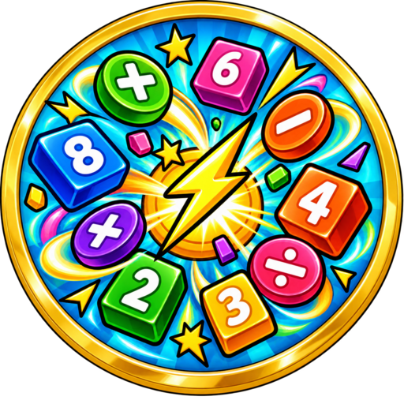 |
| `mental-math/badge.png` | 頭の中で！ | 暗算・数の操作 | 頭の中で数を動かして考えた | 数を分けたりまとめたりして暗算できた |  |
| `number-line/badge.png` | 数の道 | 数直線・順序・大小 | 数の順序、大きさ、位置関係をとらえた | 数直線や数の位置を使って比べた |  |
| `relationship/badge.png` | 関係発見！ | 数量関係 | 数や量、図形の関係を見つけた | 変化や対応の関係を説明できた |  |
| `pattern/badge.png` | きまり発見！ | 規則性 | 並びから規則やきまりを見つけた | 数や図形のきまりを見つけて続けた |  |
| `geometry/badge.png` | 図形マスター | 図形 | 図形の特徴や性質をとらえた | 図形の共通点や違いを説明できた |  |
| `spatial-sense/badge.png` | 空間マスター | 立体・空間認識 | 立体の形や位置関係をイメージした | 立体を回したり組み立てたりして考えた | 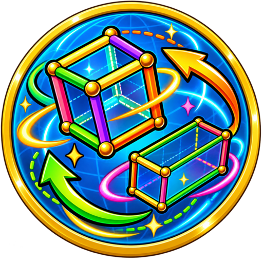 |
| `measurement/badge.png` | はかる名人 | 測定 | 量を比べたり測ったりする考え方を身につけた | 目的に合う道具や単位を選んだ |  |
| `fraction-sense/badge.png` | わける・まとめる | 分割・割合的な見方 | 部分と全体の関係を考えた | 等分、割合、比を図や言葉で表した | 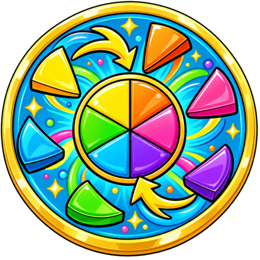 |
| `visualize/badge.png` | 図にしてみよう | 図・モデル化 | 問題の内容を図に表して考えた | テープ図や線分図、表に整理した |  |
| `logical-thinking/badge.png` | すじみち思考 | 論理・筋道 | 理由や順序を考えて答えにたどり着いた | 考え方を順序立てて説明できた | 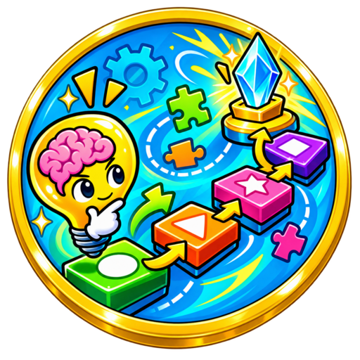 |
| `strategy/badge.png` | 作戦名人 | 解き方・見通し | 解き方の見通しをもって取り組んだ | 解く前に方法や手順を選んだ |  |
| `another-way/badge.png` | 別の解き方！ | 多様な解法 | 同じ問題の別の考え方や解き方を見つけた | 2通り以上の方法で答えを求めた |  |
| `math-discovery/badge.png` | 算数のひみつ | 算数を楽しむ・発見 | 算数の仕組みや面白さを発見した | 学習したことから新しいきまりや疑問を見つけた |  |


## Science / 理科

`assets/badges/science/` contains 15 reusable badges for science learning across observation, questioning, prediction, experimentation, fair testing, measurement, recording, comparison, evidence-based reasoning, life science, earth science, matter, energy, connections, and discovery. Each badge is a transparent 512×512 PNG.

| File | 日本語名 | テーマ | 意味 | 獲得条件の例 | Preview |
|---|---|---|---|---|---|
| `science-observer/badge.png` | かんさつ博士 | 観察 | 対象をよく観察し、特徴や変化を見つけた | 観察対象の特徴や変化を具体的に見つけた | 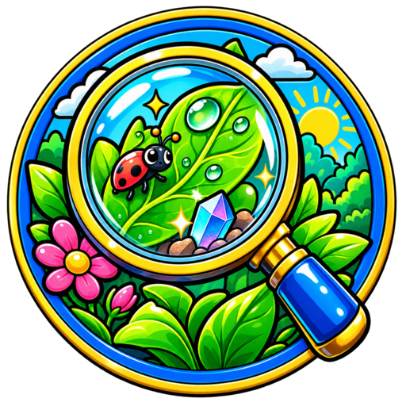 |
| `wonder/badge.png` | ふしぎ発見 | 問題発見 | 自然現象を見て疑問をもった | 「なぜだろう」と思ったことを問いにした | 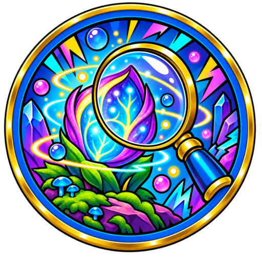 |
| `prediction/badge.png` | 予想名人 | 予想 | 経験や知識をもとに結果を予想した | 実験前に結果と理由を予想した | 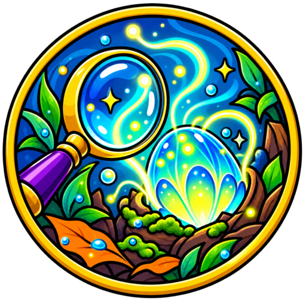 |
| `experiment/badge.png` | 実験マスター | 実験 | 実験を行って確かめた | 安全に器具を使い、実験を最後まで行った |  |
| `fair-test/badge.png` | 条件マスター | 条件制御 | 変える条件とそろえる条件を考えた | 条件をそろえて公平に比較する実験を設計した |  |
| `science-measure/badge.png` | 測定マスター | 測定 | 温度、時間、長さ、重さなどを測って調べた | 目的に合う器具と単位を選んで測定した | 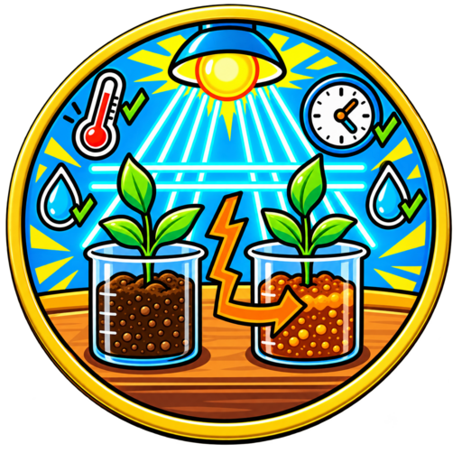 |
| `science-record/badge.png` | 記録名人 | 記録 | 観察や実験の結果を正確に記録した | 結果を図、表、数値などで記録した | 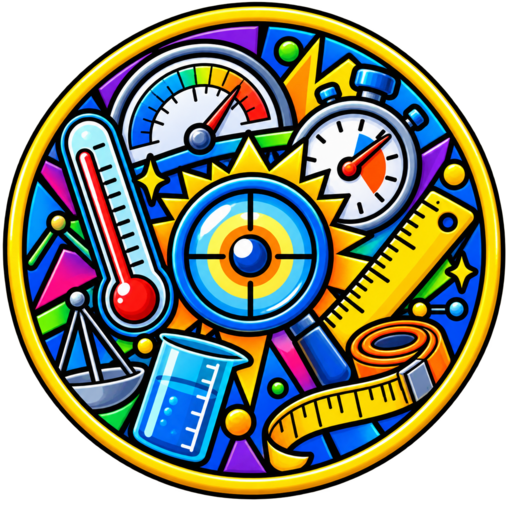 |
| `compare-results/badge.png` | くらべて発見 | 比較 | 結果を比べ、共通点や違いを見つけた | 複数の結果を比べて共通点や違いを説明した |  |
| `evidence/badge.png` | 結果から考える | 考察 | 観察・実験の結果を根拠に考えた | 結果を根拠に予想を確かめ、考えを説明した | 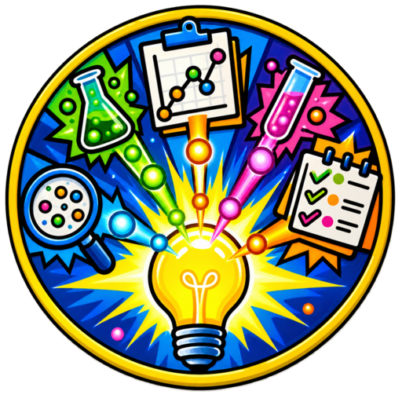 |
| `life-science/badge.png` | 生命のひみつ | 生命・生物 | 植物、動物、人の体など生命の仕組みを学んだ | 生き物の成長や体の仕組みを観察・説明した | 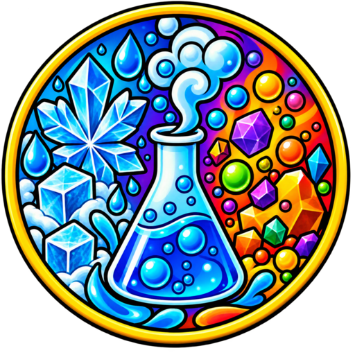 |
| `earth-science/badge.png` | 地球のひみつ | 地球・天気・宇宙 | 天気、土地、流水、地球、月や太陽について学んだ | 地球や空の変化・仕組みを観察して説明した |  |
| `matter/badge.png` | もののひみつ | 物質 | 物の性質、溶け方、状態変化を調べた | 物質の性質や変化を実験結果から説明した | 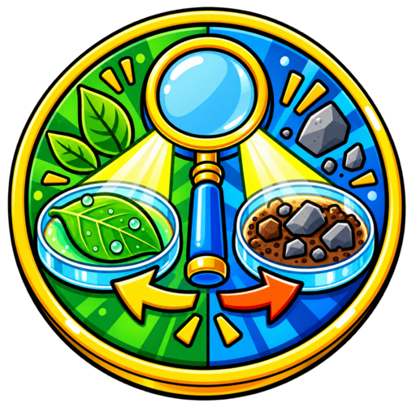 |
| `energy/badge.png` | エネルギー発見 | 物理・エネルギー | 電気、磁石、力、光、音などの現象を調べた | 現象の変化や働きを実験して説明した | 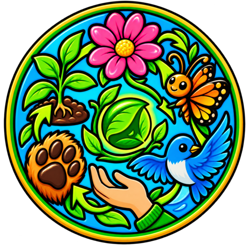 |
| `science-connection/badge.png` | しくみがつながった！ | 関係・因果 | 自然の関係や仕組みを見つけた | 条件と結果のつながりを説明した |  |
| `science-discovery/badge.png` | 科学のひみつ | 理科を楽しむ・発見 | 自然や科学の面白さを発見した | 学んだことから新しい発見や疑問を見つけた | 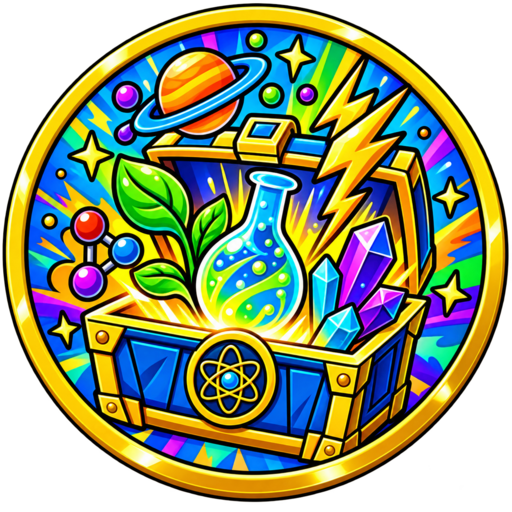 |


## Social Studies / 社会

`assets/badges/social/` contains 15 reusable badges for social-studies learning across maps, local communities, source reading, comparison, history, people, life and culture, industry, civic systems, citizenship, global connections, investigation, and discovery. Each badge is a transparent 512×512 PNG.

| File | 日本語名 | テーマ | 意味 | 獲得条件の例 | Preview |
|---|---|---|---|---|---|
| `map-reader/badge.png` | 地図マスター | 地図 | 地図から位置や広がり、場所の特徴を読み取った | 地図を使って場所や地域の特徴を説明した | 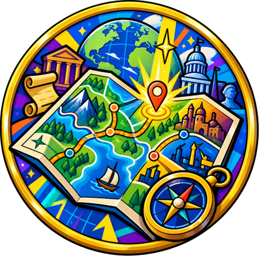 |
| `local-explorer/badge.png` | まち探検 | 地域 | 身近な地域やまちの様子について調べた | 地域の施設、土地利用、交通などを調べてまとめた | 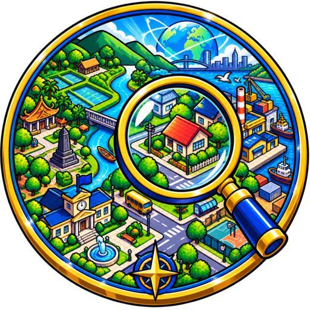 |
| `source-reader/badge.png` | 資料読み取り | 資料活用 | 地図、グラフ、写真、表などの資料から情報を見つけた | 複数の資料から必要な情報を見つけ、根拠を示した |  |
| `compare-society/badge.png` | くらべて発見 | 比較 | 地域、時代、暮らしなどを比べ、共通点や違いを見つけた | 二つの地域や時代を比べて共通点と違いを説明した |  |
| `timeline/badge.png` | 時の流れ | 時間・歴史 | 出来事を時間の順序でとらえた | 出来事や社会の変化を順序に沿って整理した | 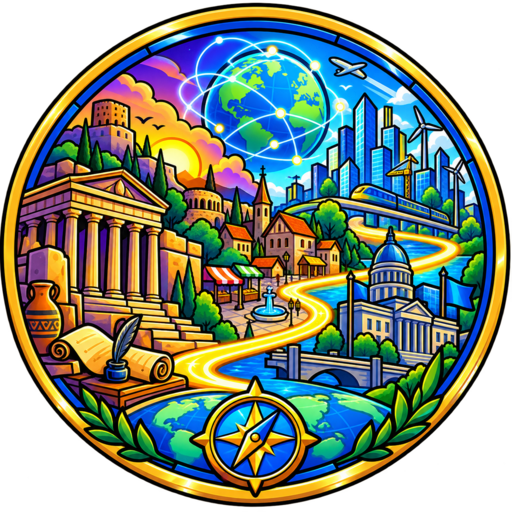 |
| `history-connection/badge.png` | 歴史がつながった！ | 歴史的因果・関連 | 歴史上の出来事同士の関係や変化を見つけた | 出来事のつながりや変化の理由を説明した | 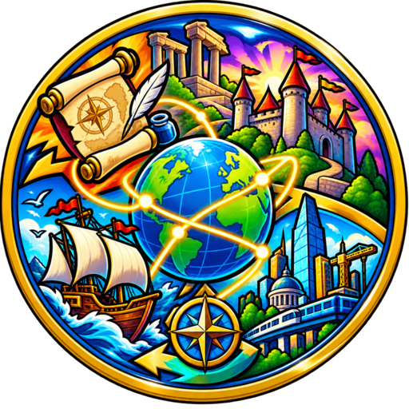 |
| `people-of-history/badge.png` | 人物探究 | 歴史人物 | 歴史上の人物が何を考え、何をしたのか調べた | 人物の働きや考えを資料から調べて説明した | 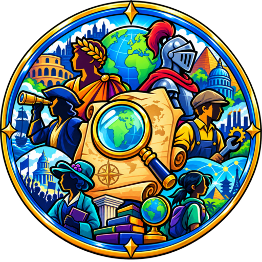 |
| `life-and-culture/badge.png` | くらし発見 | 生活・文化 | 地域や時代による人々の暮らしや文化について学んだ | 衣食住や行事などの特色を調べ、暮らしと結び付けた | 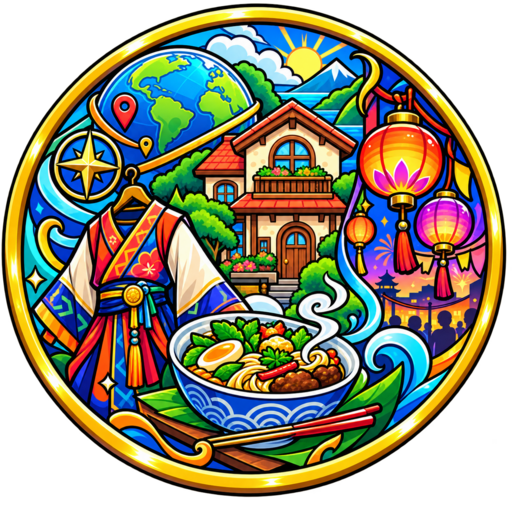 |
| `industry/badge.png` | 産業マスター | 産業 | 農業、水産業、工業、流通など、人々の仕事や産業の仕組みを学んだ | 産業の工夫や人・物の流れを資料から説明した |  |
| `society-connection/badge.png` | 社会はつながる | 社会のつながり | 人、物、情報、地域などが互いにつながって社会をつくっていることに気づいた | 地域や産業のつながりを図や言葉で表した | 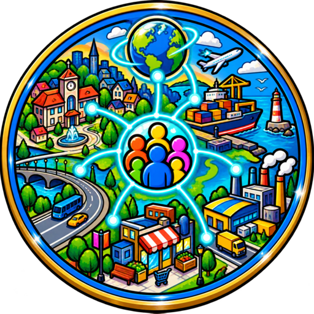 |
| `government/badge.png` | 政治のしくみ | 政治・行政 | 政治や行政がどのような仕組みで社会を支えているか考えた | 公共施設や制度の役割を人々の暮らしと結び付けた |  |
| `citizens/badge.png` | みんなの社会 | 市民・公共 | 社会はさまざまな立場の人々によって成り立っていることを考えた | 異なる立場の人々の願いや役割を考えて説明した | 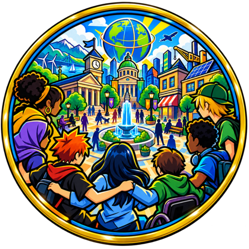 |
| `world-connection/badge.png` | 世界とつながる | 国際理解 | 日本と世界の国々とのつながりを学んだ | 貿易、交流、協力などのつながりを資料から説明した | 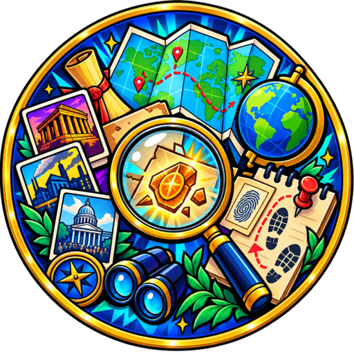 |
| `social-investigator/badge.png` | 社会科探偵 | 調査・探究 | 複数の資料や情報を集め、自分で社会の疑問を調べた | 問いを立て、資料を集めて考えをまとめた |  |
| `social-discovery/badge.png` | 社会のひみつ | 社会科を楽しむ・発見 | 人々、地域、歴史、社会の仕組みのおもしろさを発見した | 調べたことから新しい気づきや問いを見つけた | 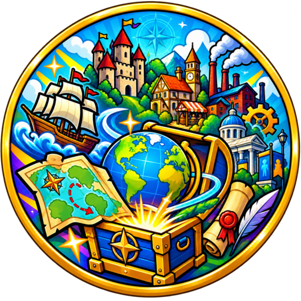 |


## ELEMENT COLLECTION / エレメントコレクション

発見し、集め、育てるための進化型エレメントコレクションです。各属性は、同じエレメントの核を保ちながら **Level 1: FOUND → Level 2: EVOLVE → Level 3: AWAKEN** と成長します。画像内部には属性名・レベル名・文字・数字を入れていません。

すべて透明512×512 PNGです。安定した公開URLは次の形式で利用できます。

`https://tt-sensei.github.io/edu-assets/assets/elements/<element>/level-<level>/badge.png`

| Element | Level 1 / FOUND | Level 2 / EVOLVE | Level 3 / AWAKEN |
|---|---|---|---|
| FIRE / 炎 | 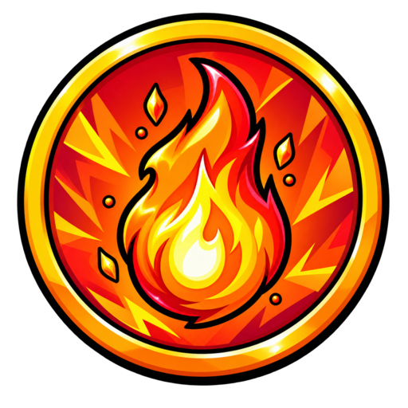 |  |  |
| WATER / 水 | 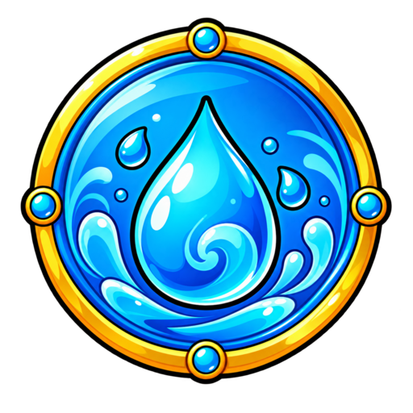 | 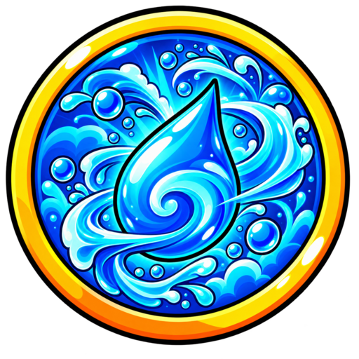 |  |
| NATURE / 自然 |  | 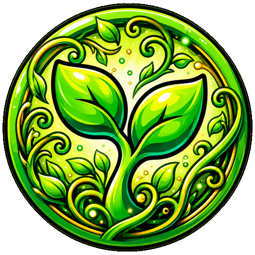 |  |
| THUNDER / 雷 |  |  | 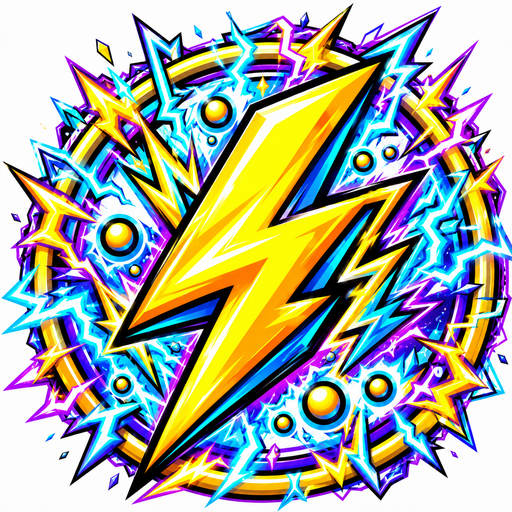 |
| ICE / 氷 |  | 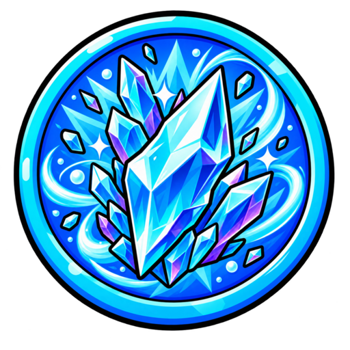 | 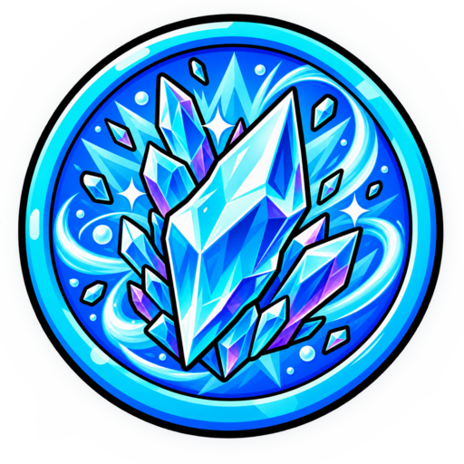 |

### 進化デザインルール

- Level 1は中央核を一つに絞った発見段階。
- Level 2は同じ核を残して、サイズ・動き・粒子・エネルギーを増やす。
- Level 3は同じ核を残して、オーラ・飛沫・火花・結晶・光線などの属性演出を最大化する。
- 既存バッジシリーズと同じ円形エナメルピン、太い黒アウトライン、高彩度、ポップな陰影、強いシルエットを基準にする。
- 追加属性も同じフォルダー構成と進化ルールで拡張する。

